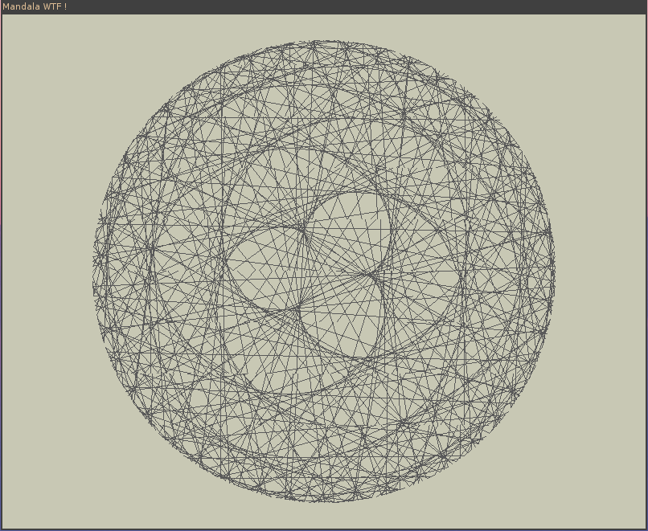

# mandala-c-sdl2

Using the C language, the SDL2 library and some modulo operations to draw cool
mandalas.

Features :

*   Use the *right arrow* to speed up mandala
*   Use the *left arrow* to reverse mandala
*   Use the *left + right arrow* combination to speed up reversed mandala
*   Use the *spacebar* to pause
*   Use *r* to rainbow :-)

Requirement :

*   C standard library
*   SDL2 library
*   math.h library
*   Possibly MinGW if using Windows

As the compilation process is rather simple, I didn't create any Makefile.
Please use :

`$ gcc mandala.c -o mandala.out -lSDL2 -lm`

On Windows, you may have to help MinGW with the SDL :

`$ gcc mandala.c -o mandala.out -lmingw32 -lSDL2Main-lSDL2 -lm`

